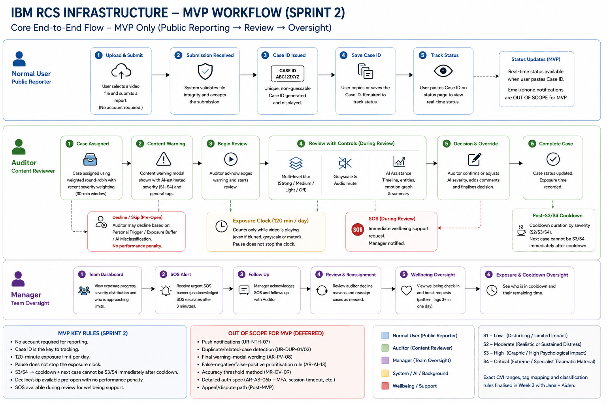
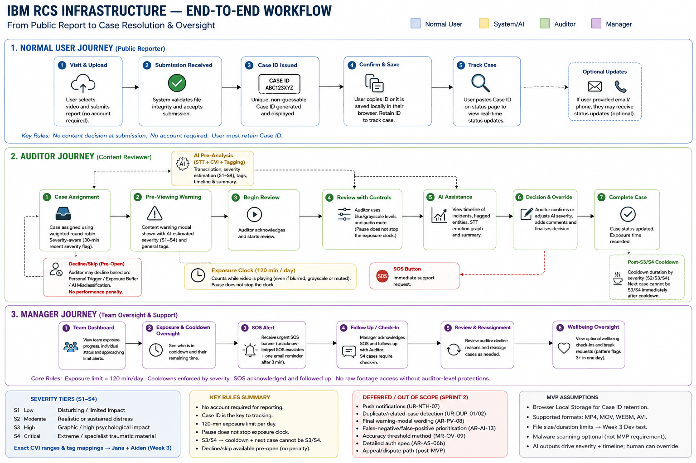

# Persona Requirements — Sprint 1 Week 2

**Owner:** Janataarah Begum

**Deliverable:** [Persona Requirements](https://docs.google.com/document/d/1VrQGkNYEAd849qMMxLy8atYuAYg6u3NAOvUbZnb-np4/edit?usp=sharing)

Defines and consolidates the requirements for the Normal User, Auditor and Manager personas, incorporating confirmed client decisions from the Week 1 session.

## Workflow Diagrams

> **Current implementation focus:** The MVP workflow is the scope being developed in this sprint. The end-to-end workflow is included for broader system context and future-state reference only.

### MVP Workflow Diagram

### End-to-End Workflow Map

