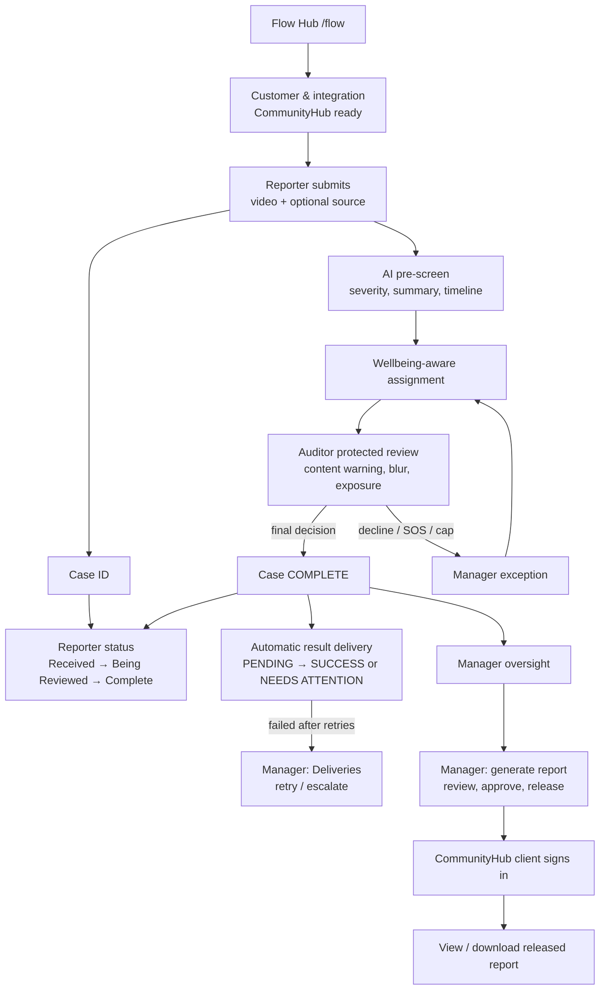

# B2B End-to-End Flow — Screen-by-Screen Spec

**Track:** Design / Product · **Owner:** Aleeya Ahmad (UX) · **Branch:** `feature/b2b-end-to-end-flow`
**Brief:** [`b2b-flow-build-brief.md`](b2b-flow-build-brief.md) · **Status:** Spec for build. Frontend only, mock data.

> Scope fence: this is the **main** end-to-end flow. The Manager Intelligence Dashboard (analytics, evidence drawer, trends), Manager Copilot and SLA metrics are deferred to a later design pass. Where a screen here has a baseline version of something that pass will grow (Manager dashboard, delivery health), it is marked **baseline**.

---

## 1. The flow



Two separate states run through everything: **Moderation status** (the Auditor's work) and **Delivery status** (the integration). They are never merged into one badge.

---

## 2. Routes and ownership

| # | Screen | Route | Persona | Guard | Build |
|---|---|---|---|---|---|
| S0 | Flow Hub | `/flow` | Presenter / demo | none | NEW |
| S1 | Customer & integration | `/manager/customers/communityhub` | Manager | manager | NEW |
| S2 | Report submission | `/` | Reporter | none | POLISH |
| S3 | Case ID confirmation | `/case-confirmation` | Reporter | none | POLISH |
| S4 | Reporter status | `/status` | Reporter | none | POLISH |
| S5 | Auditor queue / review / submit | `/auditor`, `/auditor/cases/:caseId` | Auditor | auditor | POLISH + states |
| S6 | Cooldown + block puzzle | `/auditor/cooldown` | Auditor | auditor | NEW component |
| S7 | Manager oversight | `/manager` | Manager | manager | POLISH + baseline tiles |
| S8a | Deliveries list | `/manager/deliveries` | Manager | manager | NEW |
| S8b | Delivery detail | `/manager/deliveries/:deliveryId` | Manager | manager | NEW |
| S9a | Reports list + generate | `/manager/reports` | Manager | manager | NEW |
| S9b | Report preview / approve | `/manager/reports/:reportId` | Manager | manager | NEW |
| S10 | Validation & Audit-Log | `/manager/validation` | Manager | manager | POLISH + tab |
| S11 | Client sign-in | `/client/login` | CommunityHub client | none | NEW |
| S12a | Client reports | `/client/reports` | CommunityHub client | client | NEW |
| S12b | Client report view | `/client/reports/:reportId` | CommunityHub client | client | NEW |

**Manager TopNav (7 tabs):** Dashboard · Case Oversight · SOS Inbox · Reassignment Queue · **Deliveries** · **Reports** · Validation. Customer & integration is reached from the Deliveries and Reports page headers and from the dashboard delivery-health tile.

**Client surface** has its own slim header (not the staff header) and no Manager navigation.

---

## 3. Reuse before building

| Need | Reuse |
|---|---|
| Public pages | `components/layout/PublicPage`, `AppHeader` |
| Staff pages | `StaffPage`, `ManagerLayout` (header, SOS banner, TopNav), `StaffHeader` |
| Manager tabs | `components/shell/managerSections.ts` (add two entries), `ManagerTopNav` |
| Auth | `ProtectedRoute`, `hooks/useAuth` (add role `client`, extend `ROLE_HOME`) |
| Loading / error | `components/manager/ManagerBits` → `LoadState`, `Panel`, `Figure`, `ManagerBreadcrumb` |
| Data fetch | `hooks/useStaffQuery` (staff), a sibling `useClientQuery` for the client surface |
| Severity | `components/severity/SeverityTag`, `design-tokens/severity.ts` |
| Exposure | `components/exposure/ExposureBar` |
| Demo tooling | `DemoDataBadge`, `DemoScenarioMenu`, `services/mock/demo.ts` |
| Labels | `design-tokens/*` (add `deliveryLabels.ts`, `reportLabels.ts` with pinned tests) |

## 4. Visual language

**Principle:** quiet, structured, enterprise-grade, with two dark "moments" (Flow Hub and Client sign-in) and a consistent tile system elsewhere.

| Topic | Rule |
|---|---|
| Grid | Carbon `Grid` + `Column`; content max-width 1584px (matches existing responsive header work); 16 columns at lg and up, 8 at md, 4 at sm. Page gutter 32px (lg), 16px (sm). |
| Surfaces | Page background `--cds-background` (white). Tiles `--cds-layer-01`. Public pages keep the Gray 10 page with white card. Dark bands use `<Theme theme="g100">`. |
| Type | Page title `heading-05` (28/36 semibold). Hero heading `fluid-heading-06` / expressive 42–54px on dark bands only. Section titles `heading-03` (20/28). Body `body-01`. Metadata `label-01` / `helper-text-01`. IDs, timestamps, payload in IBM Plex Mono. |
| Spacing | Carbon spacing tokens 03/05/06/07/09 (8/16/24/32/48). Section gaps 48px. Tile padding 24px. |
| Colour | `--cds-*` only. Interactive Blue 60 for actions and links only, never decoration. Support tokens for status. Severity via `severity.ts`. |
| Status | Always icon + text. Delivery: `CheckmarkFilled` Success, `Time` Pending, `Renew` Retrying, `WarningAltFilled` Needs attention. Moderation: `CheckmarkOutline` Complete. |
| Motion | Carbon `productive` for state changes (110–150ms); `expressive` only for Flow Hub tile entrance and report-release confirmation. `@media (prefers-reduced-motion: reduce)` removes all non-essential movement. |
| Depth | Borders over shadows (`--cds-border-subtle-01`); shadow only on the Flow Hub hover and the client sign-in card. |
| Icons | `@carbon/icons-react` only, 16px inline, 20px in tiles, 32px in Flow Hub stage tiles. |
| Charts | Hand-built bars from tokens, `aria-hidden`, plus a text equivalent and legend. Series differ by pattern, not just colour. |

### 4.1 Shared UI kit (`components/ui/`)

| Component | Purpose | Key props |
|---|---|---|
| `PageHeader` | Breadcrumb slot, page title, subtitle, right-aligned primary action | `title`, `subtitle?`, `breadcrumb?`, `actions?` |
| `StatTile` | Large number + label + optional status icon, optional link | `label`, `value`, `status?`, `href?`, `helper?` |
| `StageStepper` | Horizontal stage progress for the reporter form and Flow Hub | `steps`, `current` |
| `StatusTag` | Icon + text tag for moderation, delivery and report status | `kind`, `value` |
| `EmptyState` | Icon, title, body, optional action | `title`, `body`, `action?` |
| `KeyValueList` | `StructuredList`-based labelled facts (definition list semantics) | `items` |
| `TimelineList` | Vertical attempt/audit timeline with timestamp, label, outcome | `items` |
| `NotIncludedPanel` | The "never in a client report" list | none |

---

## 5. Screens

Each screen lists: purpose, layout, components, content, states, interactions, accessibility, data.

### S0 · Flow Hub — `/flow`

**Purpose.** A presenter-friendly front door that shows the whole journey and lets anyone jump into any live stage. Not a marketing site.

**Layout.** Full-width Gray 100 hero band (`Theme g100`), then a white section with a 4×2 tile grid.
- Hero (8 columns): eyebrow "IBM × RMIT · Responsible Content-Safety Infrastructure", heading "From a public report to a client-ready service report", body "RCS moderates harmful video for platforms like CommunityHub while protecting the people who review it." Primary button **Start as a Reporter** → `/`. Ghost buttons **Staff sign in**, **Client sign in**.
- Hero (right, 8 columns): hand-built journey line, 8 numbered dots joined by a 1px line, the active dot pulsing once on load (reduced-motion: static).
- Tile grid: 8 `ClickableTile`s, one per stage, numbered "01"–"08".

**Stage tiles.**

| # | Title | One-line | Persona chip | Link |
|---|---|---|---|---|
| 01 | Customer connects | CommunityHub is set up to receive results | Manager | `/manager/customers/communityhub` (needs sign-in) |
| 02 | Report | A member of the public uploads a video | Reporter | `/` |
| 03 | AI pre-screen | Severity, summary and timeline before a person sees anything | System | `/status` (sample case) |
| 04 | Protected review | An Auditor reviews with blur, limits and a way out | Auditor | `/staff/login` |
| 05 | Decision | The Auditor's decision is final and the case completes | Auditor | `/auditor` |
| 06 | Handoff | The result is delivered to CommunityHub automatically | Manager | `/manager/deliveries` |
| 07 | Oversight | Managers handle exceptions, not every case | Manager | `/manager` |
| 08 | Client report | CommunityHub signs in to a Manager-approved report | Client | `/client/login` |

**Demo access panel** (below grid, `Layer` with `StructuredList`): the three demo identities and passwords for the mock build, with "Copy" buttons. Hidden when `VITE_DATA_SOURCE=api`.

**States.** Tiles needing sign-in show a small `Locked` icon and "Sign-in required" helper; clicking routes through the login and returns to the target. No loading state (static).

**A11y.** Tiles are real links with descriptive names ("Stage 06, Handoff: the result is delivered to CommunityHub automatically"). Journey line is decorative (`aria-hidden`); the stage list is the accessible equivalent.

**Data.** None.

---

### S1 · Customer & integration — `/manager/customers/communityhub`

**Purpose.** Show that CommunityHub is a customer, that RCS knows where to send results, and that the connection works. Light by design (Naresh: B2B stays surface level).

**Layout.** `ManagerLayout`; `PageHeader` (breadcrumb Dashboard › Customers › CommunityHub; title "CommunityHub"; subtitle "Customer organisation · Social platform"). Two columns (10 / 6).

**Left column**
- **Connection tile** (`Tile`): large `StatusTag` "Connection ready" (Success) or "Needs attention" (Error), last tested time, **Test connection** button (secondary). Testing shows an inline loading `Loading small` then an `InlineNotification` "Test delivery accepted · 142 ms" (mock).
- **Result delivery** (`StructuredList`): Destination (masked URL, Plex Mono), Method "Signed HTTPS callback", Authentication "Shared secret, rotated 30 days ago", Retry policy "3 attempts, then Manager review", Idempotency "Stable delivery ID per case".
- **What CommunityHub receives** (`CodeSnippet` multi-line, read-only): the minimal payload (`delivery_id`, `case_id`, `outcome`, `final_severity`, `completed_at`) with a one-line note "Source details are included only when the Reporter supplied them."

**Right column**
- **Boundary card:** "RCS decides the moderation finding. CommunityHub decides what enforcement to apply." (`Tile` with `Information` icon.)
- **Delivery health** (compact): four counts with `StatusTag`s, link "View deliveries" → S8a.
- **Reports:** latest released report row, link "View reports" → S9a.

**States.** Loading (`LoadState`); error "Couldn't load this customer" with Retry; Connection error variant (Error tile, **Retest** primary, helper "Deliveries will keep retrying until this is fixed.").

**Not on this screen.** Pricing, contracts, user management, multi-org switcher.

**A11y.** Test button announces result via `aria-live="polite"`. Masked URL has an accessible label "Destination, masked".

**Data.** `getCustomerIntegration("communityhub")`, `testIntegration(...)`.

---

### S2 · Report submission — `/` (polish `UploadPage`)

**Purpose.** Let a member of the public report harmful content quickly, with no account, in a way that feels trustworthy and part of CommunityHub's experience.

**Layout.** `PublicPage` card widened to 960px with a left summary rail (4 columns) and the form (8 columns); stacks on small screens.

**Context header (above card).** `Tag` "CommunityHub" + "Reporting is powered by RCS" + link "How reports are handled". This is the B2B signal without a sales surface.

**Left rail (sticky).** `StageStepper` (vertical): **1 Evidence · 2 Source details (optional) · 3 Review & submit**. Below it a `Tile` "What happens next": *We check it → A trained reviewer decides → CommunityHub is told the result.* Below that `TrustBanner` content condensed to three bullets: confidential, encrypted, no account needed.

**Form (single page, three sections that visually progress; not a hidden wizard, so keyboard and screen-reader users can see everything).**
1. **Evidence.** `ContentSwitcher` (Upload video / Paste a link / Add a screenshot). `VideoDropZone` with plain guidance: "MP4, MOV, WEBM or AVI · about 10–15 minutes works best · up to 500 MB". **Remove all "placeholder" wording.** Helper: "You don't need an account."
2. **Source details (optional).** "Where did you see it?" — `TextInput` "Link to the post or its ID" (helper "This helps CommunityHub find it"), `TextInput` "Username or group", `DatePicker` "Approximate date", `TextArea` "Anything else we should know?" (500 counter). Collapsible `Accordion` "Add source details (optional)", closed by default so it never blocks reporting.
3. **Review & submit.** `RadioButtonGroup` "How would you like to report?" (Anonymously / Include my name & email; revealing fields). Consent `Checkbox`. Primary **Submit report**.

**States.** Default; evidence missing (inline error on submit, `Submit` stays enabled per UX decision of 18 Sep); consent missing; processing failed (existing full-state fallback, restyled as `InlineNotification` + retry); uploading (`FileUploaderItem` progress, cancel).

**Interaction.** Submit → `/case-confirmation`.

**A11y.** Section headings are real `h2`s; the optional accordion is closed but reachable; errors are summarised in an `aria-live` notification and linked to fields.

**Data.** `createReport` (existing) plus optional `source` object passed through (mock stores it on the case).

---

### S3 · Case ID confirmation — `/case-confirmation` (polish)

Keep content and behaviour. Align to the new type scale and tile treatment: large Plex Mono case ID in a `Tile`, **Copy case ID** primary, retention warning as `InlineNotification` (warning), updates opt-in collapsed into an `Accordion`. Add a one-line reassurance "Your report is with the review team. CommunityHub will be told the result." (neutral; no promise of action). Next-step link "Check case status" → `/status`.

---

### S4 · Reporter status — `/status` (polish `StatusLookupPage`)

**Purpose.** Simple, honest status. Safe for the public.

**Layout.** 8-column centred card on Gray 10 page.

**Content.**
- Case ID header (Plex Mono) with copy action.
- `ProgressIndicator` (existing): Received → Being Reviewed → Complete.
- **Current stage panel** with icon + heading + description.
- **Outcome panel (Complete only)**, rules below.
- "Add more information" tertiary action (existing modal).
- **What we never show:** Auditor identity, internal notes, wellbeing/SOS, delivery errors, severity, CVI.

**Outcome copy (RT-01, extended for delivery).**

| Outcome | Delivery | Heading | Message |
|---|---|---|---|
| NO_VIOLATION_FOUND | any | No Violation Found | Your report has been reviewed and no policy violation was identified based on the available information. |
| POLICY_VIOLATION_FOUND | SUCCESS | Policy Violation Found | Your report has been reviewed and a policy violation was identified. CommunityHub has been notified and will decide any action under its own policies. |
| POLICY_VIOLATION_FOUND | PENDING / RETRYING / NEEDS ATTENTION | Policy Violation Found | Your report has been reviewed and a policy violation was identified. Thank you for taking the time to submit your report. |
| CLOSED_NO_REASSIGNMENT | any | Reviewed and closed | This case has been reviewed and closed. No further action is required from you. |

The second row is the only place CommunityHub notification is stated, and only on delivery SUCCESS. The user never sees *why* the other variant was shown.

**States.** Lookup empty; not found (generic, rate-limit message after repeated attempts); Received; Being Reviewed; Complete (three outcomes); loading; error.

**Data.** `getStatus` returns, in addition to existing fields, a `public_delivery_confirmed: boolean`. Nothing else about delivery crosses the public boundary.

---

### S5 · Auditor queue, review, submit — `/auditor/**` (polish + new states)

Existing flow unchanged: queue → content warning → AI summary → review workspace → severity & comment → submit. Add the following.

**S5a · Request Support vs SOS (review workspace and cooldown).**
Two clearly different controls in the workspace side rail, never adjacent in visual weight:
- **Request support** — quiet, secondary. Label "Request support", helper "Not urgent. A manager or support person will check in." Opens a small `Modal`: radio reasons (This one was hard / I'd like a check-in / I need a break), optional note, **Send request**. On send: `InlineNotification` "Request sent. You can keep going or pause. Nothing changes for your queue."
- **SOS** — existing urgent control, red, always visible, one click, unchanged behaviour (pauses, hides content, notifies Manager, routes to S4-equivalent cooldown).
- A one-line legend under both: "Support: I need help. SOS: stop this now."

**S5b · Daily cap reached (queue).** `InlineNotification` info-to-warning (not red, non-punitive): "You've reached today's exposure limit. No new harmful-content cases will be assigned today." Queue shows no Ready rows, empty-state copy "Nothing more will be assigned today. Your total resets at 9:00 AM." Exposure bar full, text "120 / 120 min today".

**S5c · Cap reached mid-case (new state).** Full-width `Modal`-less takeover inside the workspace: playback stops, video area becomes neutral Gray fill, heading "You've reached today's limit", body "We've stopped playback and saved your progress. This case will go back to the manager to be reassigned. You won't be given more cases today." Buttons: **Return to queue** (primary), no way to continue. Saved fields summary listed read-only ("Severity adjustment and comment saved").

**S5d · Submission confirmation.** Says only: "Case complete. Your decision has been recorded." plus cooldown notice when applicable. **No delivery or CommunityHub wording** for the Auditor.

---

### S6 · Cooldown + optional block puzzle — `/auditor/cooldown`

**Purpose.** A mandatory cooldown that feels supportive, with an optional low-key activity.

**Layout.** Two columns (8 / 8).

**Left.** Existing cooldown content: title "Cooldown in progress", large countdown "14:22 remaining" (Plex Mono, `aria-live="off"`, with an off-screen announcement every minute), `ProgressBar`, end time, exposure total ("Today: 88 / 120 min. A cooldown never resets this."). Actions: **Request support** (secondary), **Stop my shift** (tertiary), manager check-in note for S4/SOS.

**Right — optional activity tile.** Heading "Take a moment (optional)". Body: "A simple block puzzle some people find helps them switch off. It doesn't shorten your cooldown and isn't a treatment." Buttons: **Play block puzzle** / **Hide**. Choice persisted for the session only.

**Block puzzle.** A generic RCS-built falling-block game on a 10×16 grid, hand-built with `canvas` or DOM cells and token colours (no Tetris branding, no copied assets). Pieces use only the Carbon categorical tokens; each piece also has a distinct pattern so colour is not the only cue. Controls: ←/→ move, ↑ rotate, ↓ soft drop, Space pause, Esc exit; on-screen buttons for each (touch). Pauses automatically on tab blur and on cooldown end. `prefers-reduced-motion`: slower fixed speed, no flashing line-clears. No score, no levels, no timer, no leaderboard, no persistence. Closing it never ends the cooldown.

**States.** Puzzle hidden / running / paused / ended ("Nice and steady. Back to your cooldown."). Cooldown ends → `InlineNotification` success "Cooldown complete. You can return to your queue when you're ready." (puzzle closes). SOS-origin cooldown shows the mandatory check-in copy.

**A11y.** The puzzle is wrapped in a labelled region, is fully optional, can be closed with Esc, never traps focus, and announces start/pause/end politely. A "Skip" link jumps past it.

---

### S7 · Manager oversight — `/manager` (polish + baseline tiles)

**Purpose.** A calm hub that answers "what needs me right now?" without becoming an analytics product (that is the deferred HD feature).

**Layout.** `ManagerLayout` → `PageHeader` ("Oversight", subtitle "Today · Organisation time"), then:

1. **Needs attention strip** (4 `StatTile`s in a row, each a link): Open SOS · Awaiting reassignment · Failed CommunityHub handoffs · At daily limit. A tile with value 0 is neutral with text "All clear"; non-zero uses the right icon and text, red only for Open SOS.
2. **Delivery health tile** (right 5 columns): four counts (Successful / Pending / Retrying / Needs attention) as a segmented bar plus text equivalent; link "View deliveries".
3. **Auditors under oversight** (left 11 columns): upgraded to Carbon `DataTable` with toolbar search, sortable columns (Exposure, State, Cases today), existing row actions (View details, Adjust limit), `ExposureBar` + text, `ExposureStateTag`, cooldown summary. Default sort: closest to limit first (fixes the existing comment/behaviour mismatch). Empty state "No auditors assigned to you yet."
4. **Rule footnote** (`helper-text`): "Daily exposure total resets at 9:00 AM and is not reset by cooldowns. (Prototype rule.)"

**Interactions.** Every tile is a real link: SOS → `/manager/sos`, reassignment → `/manager/reassignment`, deliveries → `/manager/deliveries?status=needs-attention`, at limit → table pre-filtered.

**States.** Loading skeleton tiles; error; all-clear (celebratory neutral, no confetti).

**Deferred (do not build):** trends, backlog charts, median times, evidence drawer, organisation filter.

**Data.** `getAuditorOverview`, `getSosSummary`, `listDeclinedCases`, `listDeliveries`; the strip derives counts client-side.

---

### S8a · Deliveries — `/manager/deliveries`

**Purpose.** The Manager's exception queue for case-result handoff. Normal cases never need attention here.

**Layout.** `PageHeader` ("Deliveries", subtitle "Results sent to CommunityHub", link "CommunityHub connection"). Summary row (4 `StatTile`s: Successful, Pending, Retrying, Needs attention). `DataTable` below.

**Table columns.** Case (Plex Mono link) · Outcome (`POLICY_VIOLATION_FOUND` / `NO_VIOLATION_FOUND` as text) · Severity (`SeverityTag`) · **Moderation status** (`StatusTag` Complete) · **Delivery status** (`StatusTag`) · Attempts (n of 3) · Last attempt (time) · Row action `OverflowMenu` (View details, Retry delivery).

**Toolbar.** Search by case ID; `Dropdown` filter by delivery status; tabs `All · Needs attention (n)` to make exceptions the default focus. Default tab: Needs attention when n > 0, otherwise All.

**States.** Empty "No deliveries yet"; empty filtered "Nothing needs attention", loading skeleton; error.

**A11y.** Table has a caption "Case result deliveries to CommunityHub". Status columns are text + icon.

**Data.** `listDeliveries`.

### S8b · Delivery detail — `/manager/deliveries/:deliveryId`

**Layout.** `PageHeader` (breadcrumb Deliveries › DEL-RCS-184; title "Delivery DEL-RCS-184"). Two columns (10 / 6).

**Left.**
- **Two-status header** (`Tile`): *Moderation status* `Complete` (with "Decided by Auditor · final") and *Delivery status* `Needs attention`, side by side with a short line "The Auditor's work is complete. Only the delivery needs attention."
- **Failure panel** (only when failed): reason in plain language ("CommunityHub's endpoint didn't respond (timeout)"), `InlineNotification` error low-contrast, actions: **Retry delivery** (primary), **View technical details** (tertiary → expands `Accordion` with status code, request ID, masked endpoint, last response snippet in Plex Mono), **Escalate issue** (secondary → modal with note, "Send to integration owner").
- **Attempt timeline** (`TimelineList`): Attempt 1 · 2:31 PM · Timeout; Attempt 2 · 2:36 PM · Timeout; Attempt 3 · 2:41 PM · Endpoint unavailable; Next: "No further automatic attempts".

**Right.**
- **Payload preview** (`CodeSnippet`): the five fields, read-only. Note "Idempotency: the same delivery ID is reused on every retry, so CommunityHub never processes it twice."
- **Case context** (`KeyValueList`): Case ID link → `/manager/cases/:caseId/review`, Completed at, Source (if any).
- **Boundary note:** "You can fix delivery. You can't change the Auditor's decision."

**Not present.** Any "Approve decision" or "Edit outcome" control.

**States.** Success (all green, no actions), Retrying (spinner + "Next attempt in 2 min"), Needs attention, Retrying-now (after click: button disabled, `Loading`, then success or failure notification), Not found.

**Data.** `getDelivery`, `retryDelivery`, `escalateDelivery`.

---

### S9a · Reports — `/manager/reports`

**Layout.** `PageHeader` ("Client reports", subtitle "Aggregate service reports for CommunityHub", action **Generate report**). `DataTable`: Report ID · Customer · Period · Generated · Version · Status (`StatusTag` Draft / Released) · Released by/at · row `OverflowMenu`.

**Generate report (`Modal`, 2 steps).** Step 1: Customer (`Dropdown`, CommunityHub only), Period (`DatePicker` range; presets "Last 7 days / Last 30 days / Previous month"); Step 2 summary "This report will count completed cases in this period" with **Generate draft**. After generation → navigates to S9b with `InlineNotification` "Draft created from verified case data. Review before releasing."

**States.** Empty ("No reports yet" + primary **Generate report**); loading; error; generating (`Loading` + live message).

### S9b · Report preview / approve — `/manager/reports/:reportId`

**Purpose.** The Manager reviews and releases a client communication. They approve the report, not individual cases.

**Layout.** `PageHeader` (title "CommunityHub service report · 1–30 Sep 2026", `StatusTag`, version, generated time). Left 11 columns document-style preview in a white sheet with `--cds-border-subtle`, right 5 columns sticky action rail.

**Report sheet (what the client will see).**
1. **Cases:** received, completed, open at end of period (three large numbers).
2. **Moderation outcomes:** Policy violation found / No violation found counts, violation rate; hand-built stacked bar + text equivalent.
3. **Final severity** (final Auditor severity): S1–S4 counts as bars with `SeverityTag` labels.
4. **Timeliness:** median report-to-decision time. No SLA line. A helper "No service-level target has been agreed, so none is shown."
5. **Quality:** AI–Auditor override count and rate, as aggregate only, with helper "Aggregate. Not an individual performance measure."
6. **Workflow:** declined/reassigned cases, client-relevant unresolved items.
7. **Delivery health:** successful, pending/retrying, needs attention.
8. **Manager note** (`TextArea`, optional, 600 chars, editable while Draft; shown in the sheet).
9. Footer: report ID, version, generated time, "Prepared by RCS".

Each figure has a small "How is this calculated?" `Toggletip` with a one-sentence definition. (The evidence drill-down is the deferred HD feature; this is a static definition only.)

**Action rail.**
- `NotIncludedPanel` (`Accordion` open by default): "Never included in a client report: individual Auditor wellbeing or exposure, SOS or counselling details, raw footage, internal manager notes, internal validation commentary, internal technical errors."
- Checklist (read-only checkmarks): "Figures come from completed cases", "No internal wellbeing data", "Note reviewed".
- **Approve & release** (primary). Opens `Modal` "Release this report to CommunityHub?" with body "CommunityHub's authorised users will be able to view and download it. You can't edit a released report; you can create a new version." Buttons **Release report** (primary), **Cancel**.
- **Download draft PDF** (tertiary, uses print stylesheet), **Back to reports**.

**States.** Draft (editable note, Approve enabled); Released (read-only, banner "Released 2 Oct 2026, 10:41 AM by Manager. Version 1", **Create new version** secondary); Unreliable timing data (median replaced by "Not enough reliable timestamps" with explanation); Loading; Not found. After release: `expressive` success animation (reduced-motion: static) and `InlineNotification` "Report released. CommunityHub can now view it."

**Data.** `getReport`, `releaseReport`, `generateReport`, and note update via `updateReportNote`.

---

### S10 · Validation & Audit-Log (combined) — `/manager/validation` (polish + tab)

**Purpose.** One screen for AI-vs-Auditor comparison and the governance audit log (Sprint 3 UX task).

**Layout.** `PageHeader`; the existing placeholder `InlineNotification` stays at top ("Placeholder / mock data — not real validation results."). Carbon `Tabs`: **AI vs Auditor** · **Audit log**.

**Tab 1: AI vs Auditor.**
- Existing predicted-vs-ground-truth chart, widened to 8 columns (remove the 560px cap), with text equivalent.
- **Override patterns** (`DataTable`): AI severity → Auditor severity (e.g. S2 → S3), count, share. Aggregate only, no Auditor names.
- Helper: "Disagreement isn't a verdict. The Manager interprets it."

**Tab 2: Audit log.**
- Filters: date range, case ID search, success/failed `Dropdown`.
- `DataTable` columns: Time · Case · Model (ID + version, Plex Mono) · Prompt version · Result (`StatusTag` Success/Failed) · **Prompt leakage** (score) · **Source attribution** (score) · **Accumulated score** · Tokens in/out.
- Row expand shows reasoning snippet and the raw per-call record (Plex Mono).
- Above the table: three `StatTile`s with the accumulated scores and a note "Simplified governance evaluation, built from our own call log."
- Append-only note: "Entries can't be edited or deleted."

**States.** Placeholder labelling on every figure; empty log; loading; error.

**Data.** `getValidationSummary` (existing), `listAuditLog`.

---

### S11 · Client sign-in — `/client/login`

**Purpose.** A separate, calm, external surface for CommunityHub's authorised users.

**Layout.** Gray 100 full-height split: left 8 columns brand panel (dark; "RCS Client Reports", "Service reports for CommunityHub", three quiet bullets: "Released reports only", "Your organisation's data only", "Access is logged"), right 8 columns white sign-in card (480px).

**Card.** Eyebrow "CommunityHub · Authorised users", heading "Sign in", `TextInput` "Email", `PasswordInput` "Password", primary **Sign in**. Below: helper "Accounts are created by RCS for your organisation. There's no self-sign-up."

**States.** Default; error (invalid credentials, existing pattern); locked out (5 attempts / 15 min, existing copy); session expired (in place). Copy never describes internal systems.

**Routing.** Success → `/client/reports`. A staff account signing in here is rejected with the generic error. A client account hitting `/staff/login` is rejected the same way.

**A11y.** Labels visible, errors linked, autofocus on email.

**Data.** `clientLogin` (mock account `ch-user-17` / `testpassword123`, organisation `COMMUNITYHUB`, role `COMMUNITYHUB_CLIENT`).

---

### S12a · Client reports — `/client/reports`

**Layout.** Slim client header (RCS wordmark, organisation tag "CommunityHub", user, **Sign out**) on g100; page body on white. `PageHeader` ("Reports", subtitle "Service reports released to CommunityHub"). Reports as a list of wide `ClickableTile`s (not a table), newest first: period title, released date, version, `StatusTag` "Released", headline stats (completed cases, violations found), actions **View** and **Download PDF**.

**States.** Empty ("No reports released yet. When RCS releases a report, it will appear here."); loading; error; session expired (in place reauth modal).

**Trust footer.** "Access to this page is logged." (Disclosure once, quietly, per Marielle Lee's monitoring guidance.)

### S12b · Client report view — `/client/reports/:reportId`

**Layout.** Same document-style sheet as S9b but read-only, with: header strip (report ID, version, released date), the sheet, **Download PDF** (primary), **Back to reports**. No action rail, no Manager note editing, no internal helper text.

**Download.** Uses a print stylesheet (`@media print`), page breaks per section, header/footer with report ID and "Released to CommunityHub". Toast-free: a polite `aria-live` message "PDF ready. Use your browser's save dialog." (prototype behaviour).

**Denied / other-org state.** If the report belongs to another organisation or isn't released: `EmptyState` "You don't have access to this report." with link back. Same screen for "not found" (no information leak).

**Access logging (mock).** Each view/download appends an access-log entry (`VIEW`/`DOWNLOAD`, `access_result`: `SUCCESS` / `DENIED` / `ERROR`). Visible to the Manager in a small "Access" accordion at the foot of S9b (Released state): who, action, result, time.

**Data.** `clientListReports`, `clientGetReport`, `recordReportAccess`.

---

## 6. Data additions (types, mock seed, api `notConnected`)

```ts
type DeliveryStatus = "PENDING" | "RETRYING" | "SUCCESS" | "NEEDS_ATTENTION";
interface DeliveryAttempt { attempt: number; at: string; result: "SUCCESS" | "FAILED"; reason?: string }
interface Delivery {
  delivery_id: string;            // DEL-RCS-184
  case_id: string;                // RCS-184
  organisation_id: "COMMUNITYHUB";
  outcome: "NO_VIOLATION_FOUND" | "POLICY_VIOLATION_FOUND";
  final_severity: "S1" | "S2" | "S3" | "S4";
  completed_at: string;
  moderation_status: "COMPLETE";
  delivery_status: DeliveryStatus;
  attempts: DeliveryAttempt[];
  failure_reason?: string;
  source_url?: string;
}
interface CustomerIntegration { organisation_id; name; status: "READY" | "ERROR"; destination_masked; last_tested_at; last_delivery_at; retry_policy; auth_method }
interface ReportMetrics { cases_received; cases_completed; open_at_end; violation_count; no_violation_count;
  severity_breakdown: Record<"S1"|"S2"|"S3"|"S4", number>; median_report_to_decision_minutes: number | null;
  override_count; override_rate; declined_reassigned; delivery: { success; pending; retrying; needs_attention } }
interface Report { report_id; organisation_id; period_start; period_end; status: "DRAFT" | "RELEASED"; version;
  generated_at; released_at?; released_by?; manager_note?; metrics: ReportMetrics }
interface ReportAccessEntry { report_id; user_id; organisation_id; action: "VIEW" | "DOWNLOAD";
  access_result: "SUCCESS" | "DENIED" | "ERROR"; reason?: string; at: string }
interface AuditLogRow { entry_id; case_id; at; model_id; model_version; prompt_version; success: boolean;
  prompt_leakage: number; source_attribution: number; accumulated_score: number; tokens_in: number; tokens_out: number; reasoning?: string }
```

**Seed.** Organisation CommunityHub; 12 deliveries covering every state (8 SUCCESS, 1 PENDING, 1 RETRYING, 2 NEEDS_ATTENTION with 3 attempts); 2 reports (1 DRAFT for Sep 2026, 1 RELEASED for Aug 2026); client user `ch-user-17`; ~20 audit rows incl. 2 failed. Numbers must be internally consistent (counts in the report equal seeded cases; delivery totals equal the deliveries list).

**Demo scenarios (menu additions).** "Fail next delivery", "Make a delivery retry", "Hit exposure limit mid-case" (existing `reachExposureLimit` re-used), "Reset delivery data".

**Roles.** `staff` roles gain `"client"`; `ROLE_HOME.client = "/client/reports"`; `ProtectedRoute allowedRole="client"`; session keys reuse the existing pattern.

---

## 7. Microcopy bank (pin with tests)

| Key | Copy |
|---|---|
| Delivery status | Successful · Pending · Retrying · Needs attention |
| Delivery sentence (Manager) | The Auditor's work is complete. Only the delivery needs attention. |
| Boundary | RCS decides the moderation finding. CommunityHub decides what enforcement to apply. |
| Cap reached (Auditor) | You've reached today's exposure limit. No new harmful-content cases will be assigned today. |
| Cap mid-case | We've stopped playback and saved your progress. This case will go back to the manager to be reassigned. |
| Request support | Not urgent. A manager or support person will check in. |
| SOS legend | Support: I need help. SOS: stop this now. |
| Puzzle | A simple block puzzle some people find helps them switch off. It doesn't shorten your cooldown and isn't a treatment. |
| Report release | CommunityHub's authorised users will be able to view and download it. You can't edit a released report; you can create a new version. |
| Not included | Individual Auditor wellbeing or exposure, SOS or counselling details, raw footage, internal manager notes, internal validation commentary, internal technical errors. |
| Client empty | No reports released yet. When RCS releases a report, it will appear here. |
| Client denied | You don't have access to this report. |
| Access disclosure | Access to this page is logged. |
| Reset rule | Daily exposure total resets at 9:00 AM and isn't reset by cooldowns. |

Avoid: "willingly", "no penalty", clinical claims about the puzzle, "Tetris", "SLA compliance", and any wording implying removal or enforcement by RCS.

---

## 8. Demo script (10 minutes)

1. `/flow` — walk the eight stages.
2. `/` — submit a video report as an anonymous reporter; copy the case ID.
3. `/status` — show Received → Being Reviewed.
4. `/staff/login` as `auditor-1` — review the hero case, request support, finish with an outcome; show cooldown + puzzle.
5. Demo menu: "Fail next delivery" → complete another case.
6. `/staff/login` as `manager-1` — oversight tiles show 1 failed handoff; open it; retry; success.
7. Reports — generate a September draft; review; **Approve & release**.
8. `/client/login` as `ch-user-17` — open the released report, download PDF; try another org's report to show denied.
9. `/status` — show the Complete outcome now says CommunityHub was notified.

Accounts (mock): `auditor-1`, `manager-1`, `ch-user-17`, password `testpassword123`. Deployed API build uses its own seeded accounts.

---

## 9. Test matrix

| Area | Unit / page | jest-axe | Keyboard walkthrough |
|---|---|---|---|
| Flow Hub | tile links, demo panel hidden in api mode | yes | tab through 8 tiles |
| Upload (polish) | optional source fields, consent errors | yes | complete submit by keyboard |
| Status | all four outcome × delivery combinations pinned | yes | lookup → result |
| Auditor | request support modal, cap states, no delivery wording | yes | request support, cap mid-case |
| Cooldown puzzle | start/pause/exit, no effect on timer, reduced-motion | yes | arrows, Space, Esc |
| Manager dashboard | tile counts derived correctly, sort | yes | TopNav order (7 tabs) |
| Deliveries | filters, retry transitions, no "approve decision" control | yes | filter → open → retry |
| Reports | generate, edit note, release modal, read-only after release | yes | generate → release |
| Validation & Audit | tab switch, placeholder labelling | yes | tab keys |
| Client | login, role separation, other-org denied, access log written | yes | login → view → download |
| Services | each new op: mock behaviour, api `notConnected` | n/a | n/a |
| Labels | `deliveryLabels`, `reportLabels` pinned | n/a | n/a |

Existing tests to update: `ManagerTopNav.test.tsx` (7 tabs), Manager TopNav order in `KeyboardNavigation.test.tsx`, `canonicalLabels.test.ts`.

---

## 10. Out of scope (recorded so it isn't lost)

Manager Intelligence Dashboard (needs-attention analytics, backlog and workload views, evidence/"How is this calculated?" drill-down with contributing case IDs, organisation filter and period selector on the dashboard), Manager Copilot, SLA metrics, real backend endpoints, email or SSO/MFA for clients, CommunityHub enforcement UI, multi-tenant admin.

## 11. Open points to confirm with the team (do not block the build)

1. 9:00 AM working-day reset is a prototype rule (BA baseline still lists it open).
2. The CommunityHub handoff payload is the minimal five fields; confirm with Naresh.
3. Whether the Reporter outcome may state "CommunityHub has been notified" (this spec allows it only on delivery SUCCESS; RT-01's scope note should be amended by Jana).
4. Weekly vs daily reset language in the Sprint 3 plan ("daily/weekly reset") conflicts with the daily-only model in the extras doc.
